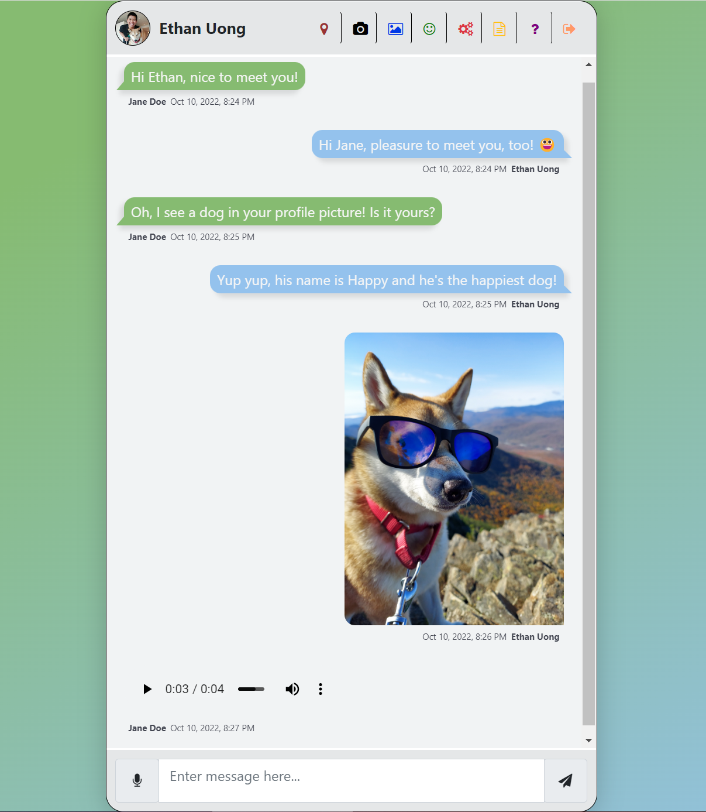

# Chat With Me

> A chatting web app built with React, Express, Socket.io, and MongoDB

[Click here to start chatting!](https://chat-with-ethan.herokuapp.com/)



## Features
Chat With Me with a public chatroom where any participant can send test messages, audio voicemails, images, emojis, and even selfies! Online communication can help young people build and develop social skills and gives them a platform to share their skills and help each other out.

## Technologies 🔧
+ [React](https://reactjs.org/)
+ [Express](https://expressjs.com/)
+ [Socket.io](https://socket.io/)
+ [Cloudinary](https://cloudinary.com/)
+ [MongoDB](https://www.mongodb.com/)

React serves the frontend. Backend is done with Node and Express to wire up with Socket.io for messaging. Express is also used to load the existing messages as well as provide endpoints to manage MongoDB. I purposely left out authentication and authorization to encourage the general public to participate. Participants info such as their profile name is stored in their local storage. All images are stored in an image management system, Cloudinary.


## Development
- client folder contains frontend related artifacts
  - ```yarn start``` runs the application
  - ```yarn build``` builds the static resources
- server folder contains backend related files
  - ```yarn start``` kicks off the server

## Deployment
- Push server
  - If you host the socket.io server with Heroku, follow the following instruction
  - Heroku Setup
      ```
      npm install -g heroku
      heroku login
      heroku git:remote -a your-app
      git subtree push --prefix server heroku master
      ```
- Push client
  - Use your preference to host your client app. I would suggest to use Netlify as it auto builds for you upon a Git push. Github Pages is another option too but you'll need to configure and manage the Github Actions for automation.
  - Run ```yarn build``` and then deploy.

#### License ⚖️
[MIT](https://en.wikipedia.org/wiki/MIT_License)
